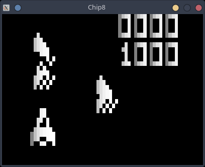
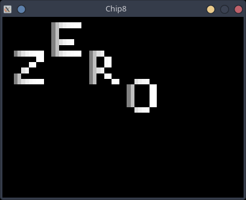
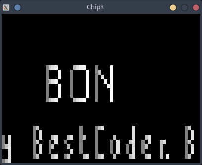

## README

A basic CHIP-8 emulator written in golang for fun.

### What works
Everything except sound.

### Screenshots
#### Astro-dodge Game
 
#### Zero Demo

#### Test Rom

### Resources
* The Instruction manual used from [cowgod](http://devernay.free.fr/hacks/chip8/C8TECH10.HTM)
* Roms were taken from [chip8go](https://github.com/jamesmcm/chip8go/tree/master/roms) repo
* Golang SDL2 [bindings](https://github.com/veandco/go-sdl2)
* [devenv ](https://devenv.sh/)